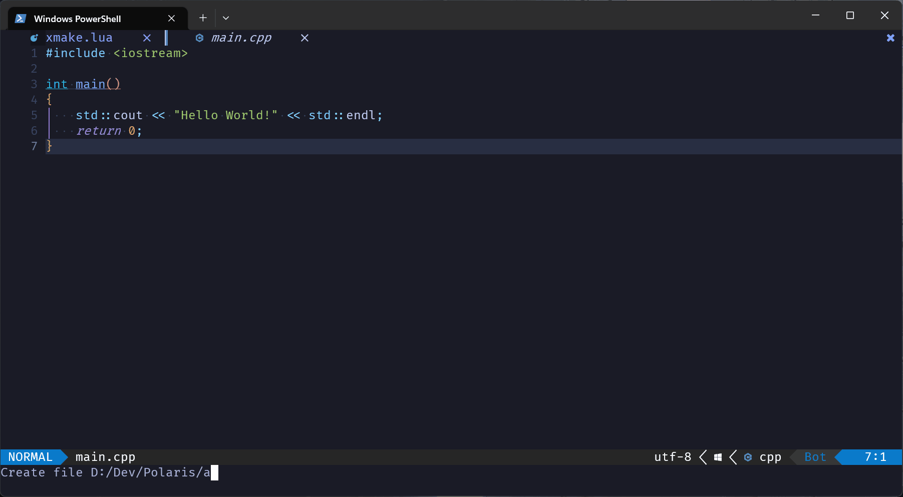
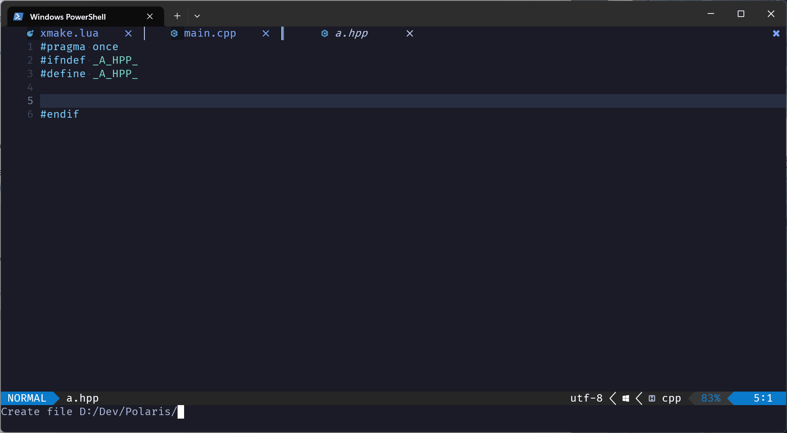
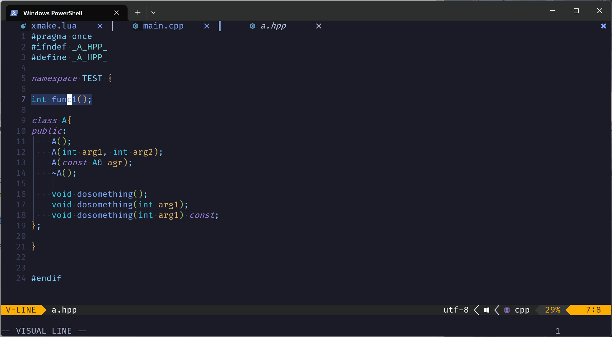
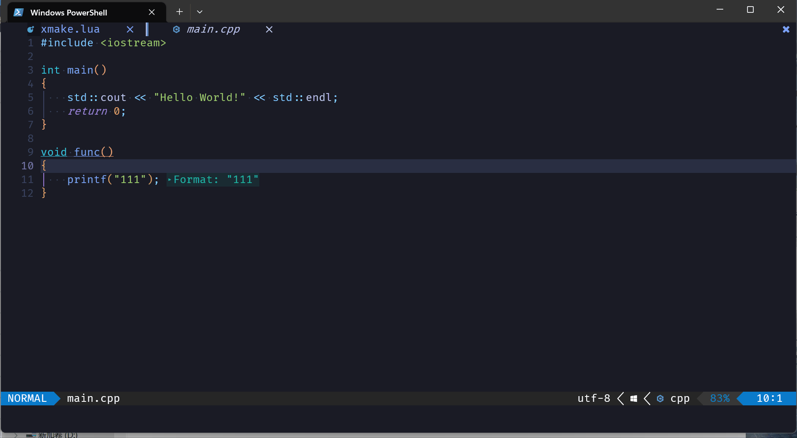

# nvim-cpptools
A usefull cpp tools for nvim，the tool includes quick creation of files, folders, moving multiple lines within files, and creating function definitions in source files through the declarations in header files.

## Requirement
- The functionality that generates the function definition depends on [nvim-treesitter](https://github.com/nvim-treesitter/nvim-treesitter).

## Installation
if you are using packer.nvim. **nvim-treesitter needs to be installed**
```
use 'liaozixin/nvim-cpptools'
```

## How to use
### Create file or directory
If you create a header file, macro definitions that prevent duplicate inclusion are automatically added. If you create a source file, it will automatically include header files with the same name in the current directory. you can use **\<Tab\>** to complete input.


```
lua require("cpptool").create_file()
```
You can bind it to your favorite keys. example：
```
vim.api.nvim_set_keymap('n', 'cf', [[<cmd>lua require("cpptool").create_file()<CR>]], {noremap = true, silent = true})
```
### Create function definition

```
lua require("cpptool").create_func_def()
```
example：
```
vim.api.nvim_set_keymap('n', 'if', [[<cmd>lua require("cpptool").create_func_def()<CR>]], {noremap = true, silent = true})
```
### Move lines

```
lua require('cpptool').move_lines("up")
lua require('cpptool').move_lines("down")
```
example:
```
vim.api.nvim_set_keymap('', '<M-Up>', [[<cmd>lua require('cpptool').move_lines("up")<CR>]], {noremap = true, silent = true})
vim.api.nvim_set_keymap('', '<M-Down>', [[<cmd>lua require('cpptool').move_lines("down")<CR>]], {noremap = true, silent = true})
```
